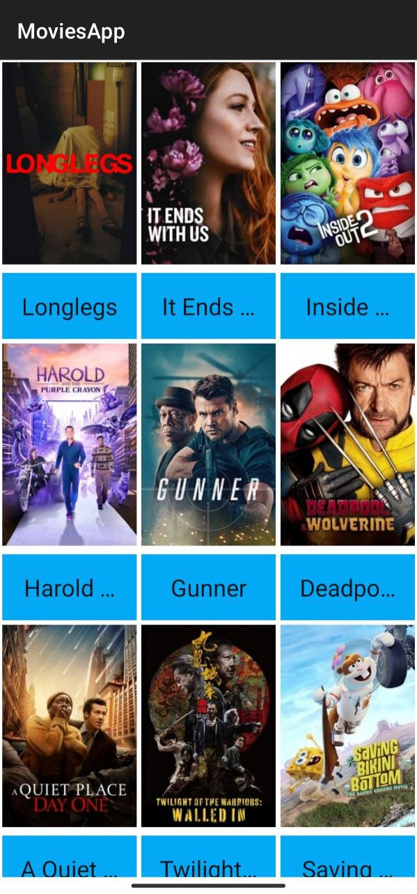
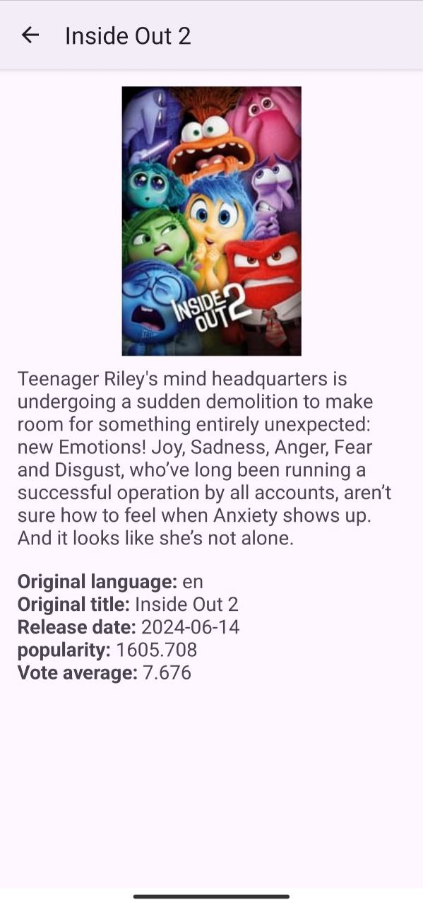
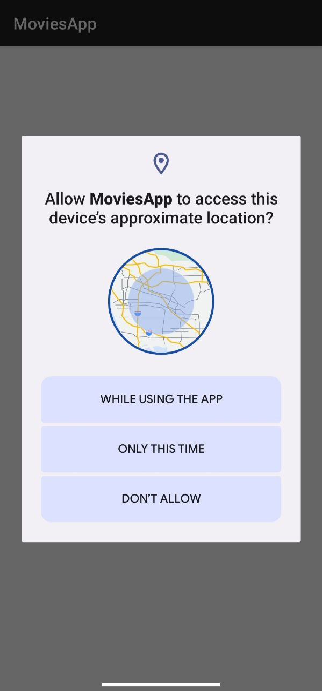

# Movies App

Aplicación maestro detalle que solicita y muestras peliculas populares, en función de la ubicación geografica.

## Tabla de Contenidos

- [Movies App](#movies-app)
    - [Tabla de Contenidos](#tabla-de-contenidos)
    - [Características](#características)
    - [Screenshots](#screenshots)
    - [Instalación](#instalación)

## Características

Este proyecto incluye las siguientes funcionalidades:

- **View Binding**: Enlace eficiente de vistas para evitar llamadas repetitivas a `findViewById()`.
- **ViewModel**: Manejo de la UI y lógica de negocio utilizando el patrón MVVM.
- **Coroutines**: Manejo de operaciones asíncronas utilizando Kotlin Coroutines.
- **LiveData y Flows**: Observación de cambios de datos en la UI en tiempo real.
- **Retrofit**: Llamadas HTTP para consumir APIs REST.
- **ConstraintLayout**: Diseño flexible y optimizado para diversas pantallas.
- **Image Loading (Glide/Picasso)**: Carga eficiente de imágenes.
- **RecyclerView**: Renderizado eficiente de listas.
- **Dependency Injection (Hilt)**: Inyección de dependencias para una arquitectura más limpia y modular.
- **Permisos de Sistema**: Solicitud y manejo de permisos dinámicos en la app.
- **Arquitectura Limpia (Clean Architecture)**: Separación de capas para asegurar escalabilidad y mantenimiento.
- **Patrón de Repositorio**: Separación de la lógica de datos de la lógica de presentación.


## Screenshots

<h3 align="center">Aquí algunas capturas de pantalla de la aplicación:</h3>

<table>
<td width="50%">
<div align="center">



</div>                                                                       
</td>                                                         
<table>                                                                                 

## Instalación

1. Clona este repositorio:
   ```bash
   git clone https://github.com/tu-usuario/nombre-del-proyecto.git
